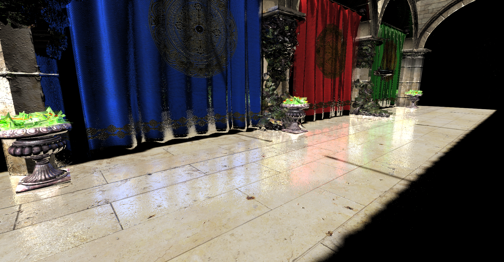

# TinyEngine
A tiny game engine based on opengl (Not Finished)

## Main Feature
- Now
	- Forward Rendering
	- Shadow mapping
	- PCF/PCSS
	- Deferred Rendering
	- PBR
	- Tonemapping
	- SSR
	- FXAA (Console)
	- ImGUI
	- Skeletal Animation 
 - Later (If I have time and interest later)
	- Cloth Simulation
	- SPH/PBD

## Environment
 - VS2019		x86 DEBUG
 - glad	 glfw3 	Dear Imgui-Dock	assimp-v.5.0.0.rc2

## User Guide
 - Camera Control: W/S/A/D/Q/E  forward / back / left / right / up / down
 - H -> hide mouse cursor
 - If you want to show different pass texture, please define DEBUG in macro.h
 - Create Lights in graphics/light/LightManager.cpp InitBasicLights()
 - Create Models in graphics/Scene.cpp init
 - If you want to enable SSR please edit in PassThrough.frag
 - The Sponza resource is too big, I don't upload
## Show some result
 - Simple GUI

 - Simple Linear Skeleton Animation

 - Simple SSR

## Problem encountered:
 - PCSS may light leaking, we should avoid higher object hiding lower object in shadow map space. 
Otherwise, bigger filtersize will be choose

 - Dear IMGUI TreeNode's input name should be different, otherwise they are the same, 
you will control all at the same time
 - Circular Include
 - Skeleton Animation, pass int (when pass BoneID) Should use "glVertexAttribIPointer" not "glVertexAttribPointer"